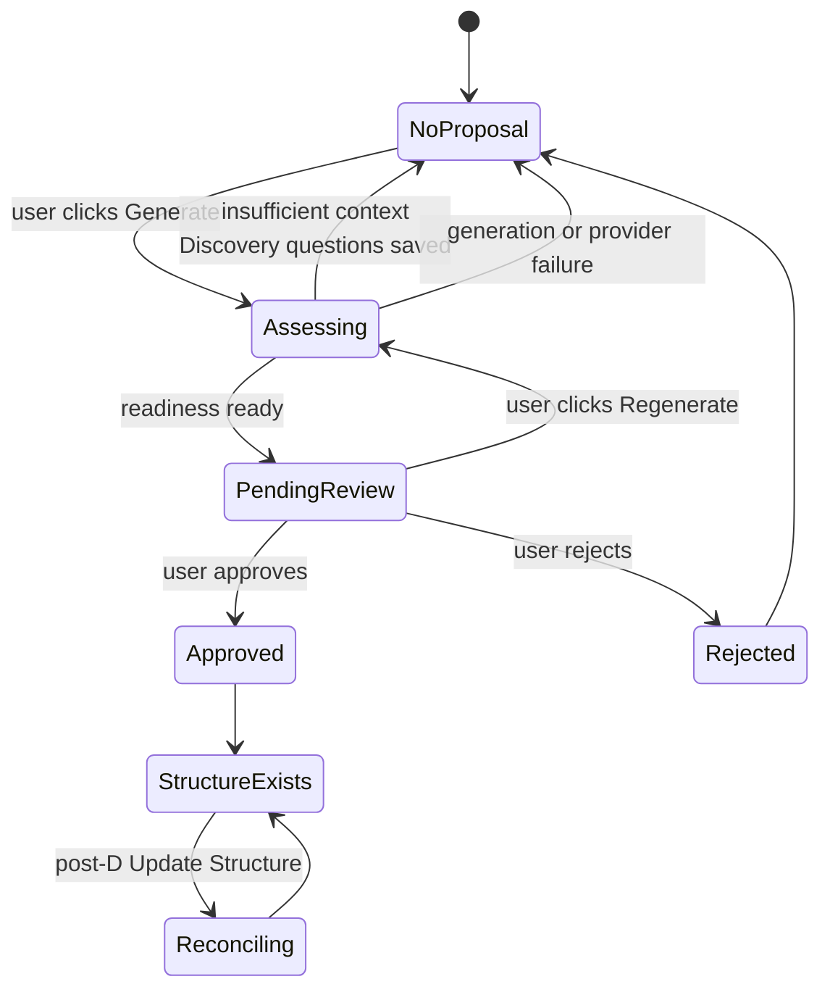

# Universe AI — Architecture

Durable technical architecture for Stage D and beyond. For product context see `docs/PROJECT.md`. For approved Product/UX v2 direction see `docs/PRODUCT_UX_V2.md`. For UI behavior see `docs/UI.md`. For implementation progress and the **Resume Here** handoff see `docs/CURRENT_STATE.md`.

**Post-Stage-E.1 status:** Stages E and E.1 are **implemented and manually accepted** on branch `stage-e1-planning-chat-concurrency-hardening` (acceptance `b7eb057`). The **current gate** is **Product/UX Architecture v2** (interim documentation baseline — work not complete). **Next product-owner decision:** Decision 6. **Stage F is not started** and remains blocked until after final Product/UX approval and the UI redesign milestone. Stages F–I remain **approved but not implemented**; the documented F–I sequence is authoritative until a pending roadmap-reorder decision is resolved (see `docs/PRODUCT_UX_V2.md`).

---

## Core principle

**AI proposes; the user reviews and explicitly approves; the server applies the change atomically.**

Structural change rules:

- Every **AI-generated** structural change requires an explicitly approved proposal applied by an atomic server/database operation.
- Direct **user-initiated** structural edits do not necessarily require an AI proposal.
- **All** structural edits — whether user-initiated or AI-proposed — must use validated atomic server/database operations.
- The AI must never apply structural changes autonomously.
- No structural change may be applied from the client, from a prompt, or from an AI response without passing through a validated server-side database operation.

---

## Stage D boundary

### In scope for Stage D

- Exactly one pending structure proposal per Root Planning conversation
- Regeneration that atomically supersedes the previous pending proposal
- Proposal cards inside the chronological conversation timeline
- Code-owned, domain-neutral Root Planning system prompt
- Compact World brief supplied to Root Planning requests
- Explicit user-triggered readiness assessment
- Discovery questions when context is insufficient
- Approval and rejection
- Initial topic-node creation through an atomic RPC (one-time per World)
- Enforcement that Generate World Structure cannot create a second initial structure after topic nodes exist
- Map refresh after approval

**Optional final Stage D commit (may be deferred without blocking Stage D completion):**

- Generate with Assumptions, offered after two insufficient Discovery rounds

### Post-D roadmap (approved sequence)

| Stage | Capability | Status |
|---|---|---|
| **E** | Non-root Planning | **Implemented** — manually accepted |
| **E.1** | Planning Chat Concurrency Hardening | **Implemented** — manually accepted |
| **Product/UX v2** | Product/UX architecture decisions | **In progress** — interim baseline checkpoint |
| **UI redesign** | UI redesign gate | **Not started** — after final Product/UX approval; before Stage F |
| **F** | Secondary Relations MVP | Approved — not implemented |
| **G** | AI Relation Proposals | Approved — not implemented |
| **H** | Impact Review | Approved — not implemented |
| **I** | Structure Reconciliation | Approved — not implemented |

**Approved future concepts (not implemented):**

- **Decision** — approved first-class future concept
- **Task** — approved first-class future concept; executor is Human, AI, or Hybrid
- **Policy engine / Working Agreement** — approved future architecture direction
- **Event** (routine execution history) — approved conceptual distinction from Decision; detailed model TBD

**Superseded / not the approved future model:**

- **Execution as a separate conversation type** — not the approved future product model. Approved direction: Tasks plus inspectable execution state / surfaces.

**Approved workspace concepts (entity design open):**

- **Files / Artifacts** — part of the approved Project Workspace concept; first-class entity, versioning, and detailed semantics **not yet formally approved**
- **Inspectable execution runs** — conceptual requirement for future AI execution; generalized Run entity model **not yet formally approved**

**Deferred indefinitely or until later stages:**

- Full Context Engine
- SPLIT / MERGE
- `conversation_events` table
- Generate with Assumptions (optional; deliberately deferred from Stage D)
- First-class Contract entity (legacy deferred item)
- Autonomous structural decomposition inside delegated subtrees

---

## Product state machine

Discovery is **not** a separately persisted session state. Discovery questions are ordinary assistant messages; readiness is evaluated only on an explicit Generate click.



**Derived persisted states:**

| UI state | Database signal |
|---|---|
| No proposal | No `branch_suggestions` row with `status = 'pending'` for the conversation |
| Pending review | Exactly one row with `status = 'pending'` |
| Assessing | An `ai_run` with `status = 'running'` and branch-suggestion metadata for the conversation |

**User-facing actions:**

| Action | When available |
|---|---|
| Generate World Structure | World has no approved topic-node structure yet; no active assessing run; explicit click only |
| Discovery | Returned when readiness is insufficient; questions appear as an assistant message |
| Regenerate | A pending proposal exists; supersedes on success |
| Approve | Exactly one pending proposal |
| Reject | Exactly one pending proposal |

**Update Existing Structure** is a separate post-D flow for Worlds that already have an approved structure.

---

## Proposal lifecycle

### Persisted statuses

- `pending` — awaiting user review
- `approved` — user approved; nodes created
- `rejected` — user rejected
- `superseded` — replaced by a newer proposal during regeneration

### Invariant

At most one `pending` proposal per `conversation_id`, enforced by a PostgreSQL partial unique index:

```sql
create unique index branch_suggestions_one_pending_per_conversation_idx
  on public.branch_suggestions (conversation_id)
  where status = 'pending';
```

UI logic alone cannot enforce this. The index survives concurrent requests and direct database access.

### Regeneration

1. Generate and validate the replacement proposal first.
2. If generation fails, the existing pending proposal is preserved unchanged.
3. On success, atomically mark the old proposal `superseded` and insert the new `pending` proposal.
4. Historical proposals (`approved`, `rejected`, `superseded`) are retained for audit.

### Approval and rejection

- Only `pending` proposals may transition.
- Approval and rejection must each be atomic database operations.
- `superseded` proposals must never be approvable.

The existing `approve_branch_suggestion` RPC creates initial topic nodes under Root. It is suitable for initial structure creation only. Structure Reconciliation requires a separate future RPC.

---

## Initial structure creation (one-time per World)

**Generate World Structure** is the initial-structure flow. It is available only while the World does not yet have an approved or created topic-node structure.

After initial topic nodes exist:

- Generate World Structure must not create or approve another initial structure.
- The future action for a structured World is **Update Existing Structure** (post-D).
- Server, database, and RPC validation must enforce this — not only the UI.
- The API should eventually return a stable conflict such as `structure_already_exists`.

Implementation must derive structure existence from authoritative database state (for example, whether topic nodes already exist under Root for the World) and **recheck atomically during approval**. The exact detection mechanism is not finalized here; it must be verified against the current schema during implementation.

`approve_branch_suggestion` must reject approval when an initial structure already exists for the World.

---

## Active generation and stale runs

A running branch-suggestion `ai_run` must not block generation forever after a server crash or abandoned request.

Requirements:

- Active-generation detection requires a **bounded stale-run policy**. Stale `running` branch-suggestion runs should be safely failed or ignored according to the final implementation.
- Prefer a **database-enforced invariant** that prevents more than one active Branch Suggestion generation per conversation.
- The guard should occur **before calling OpenAI** whenever possible.
- The exact index and/or RPC approach must be verified against PostgreSQL and the existing `ai_runs` schema during implementation.

---

## Database changes (approved target)

### Migration sequencing

**Migration 1 — enum only (separate file):**

```sql
alter type public.branch_suggestion_status add value 'superseded';
```

PostgreSQL does not allow a newly added enum value to be used in the same transaction. The index and RPCs that reference `superseded` must be in a later migration.

**Migration 2 — invariant, RPCs, and hardening (separate file):**

1. Deterministic duplicate backfill — keep the newest pending row per conversation using `created_at desc, id desc`; mark all others `superseded` with `decided_at = now()`.
2. Create the partial unique index (see above).
3. Add `replace_pending_branch_suggestion` RPC (see below).
4. Harden `approve_branch_suggestion` — reject `superseded` (and any non-`pending`) status.
5. Add atomic `reject_branch_suggestion` RPC.

Exact commit grouping within this migration may be adjusted, but backfill must precede index creation, and approval hardening must ship in the same release sequence as the `superseded` enum value.

### `replace_pending_branch_suggestion` RPC

Approved narrow contract (exact SQL signature may be refined during implementation):

```
replace_pending_branch_suggestion(
  p_conversation_id,
  p_ai_run_id,
  p_schema_version,
  p_payload
)
```

The RPC must **derive and verify** World and parent Root node from the conversation. It must not trust separately supplied `worldId` or `nodeId` values from the client.

Required validations:

- Conversation exists
- Conversation kind is `planning`
- Conversation's node is the Root node for its World
- `ai_run` belongs to the same conversation
- `ai_run` is a Branch Suggestion run (via metadata)
- `pg_advisory_xact_lock` on the conversation id before supersede-and-insert

Returns the inserted `branch_suggestions` row.

### Deferred schema (post-D)

| Change | Purpose |
|---|---|
| `nodes.archived_at` | Archive without deletion |
| `worlds.structure_revision` | Detect stale reconciliation proposals |
| `branch_suggestions.kind` | Distinguish initial vs reconciliation payloads |
| `branch_suggestions.base_structure_revision` | Optimistic concurrency for reconciliation |
| `apply_structure_reconciliation` RPC | Atomic multi-operation apply |
| `conversation_events` | Generalized timeline for many event types |

---

## API and structured-output contracts

### Generate World Structure — POST

- Remains an explicit user action; no body required for the core flow.
- If Generate with Assumptions is implemented, accept only a strict body such as `{ mode: "auto" | "with_assumptions" }` — no prompt text.
- Forward `request.signal` for cancellation.

**Response variants (approved target):**

| Outcome | HTTP | Body |
|---|---|---|
| Ready proposal | 200 | `{ outcome: "proposal", suggestion: BranchSuggestionDto }` |
| Insufficient context | 200 | `{ outcome: "discovery", message: { id, role, content, createdAt } }` |
| Generation in progress | 409 | `{ code: "generation_in_progress" }` |
| Pending conflict (non-regenerate) | 409 | `{ code: "pending_proposal_exists" }` |
| Initial structure already exists | 409 | `{ code: "structure_already_exists" }` |
| Existing failure codes | 400/404/422/500/502/499 | Unchanged from D3 Commit 1 |

Discovery questions are persisted as one ordinary assistant message linked to `ai_run_id`, with the `ai_run` completed and provider metadata stored where available.

### StructureAssessmentV1 (transient envelope)

Readiness and proposal are separate TypeScript concepts returned within **one** structured Responses API request. Only the proposal payload is persisted on the ready path.

```
StructureAssessmentV1 {
  schemaVersion: 1
  readiness: "ready" | "insufficient"
  missingInformation: string[] | null
  questions: string[] | null        // 1–3 when insufficient
  proposal: BranchSuggestionV1 | null
}
```

Server-side Zod refinement (never trust the model):

- `readiness === "ready"` → `proposal` present, `questions` absent
- `readiness === "insufficient"` → 1–3 `questions` present, `proposal` absent

Invalid envelopes map to `invalid_structured_output`.

**Persisted on ready path only:** existing `BranchSuggestionV1` (`schemaVersion`, `rationale`, `nodes`). The assessment envelope is transient.

`MAX_SUGGESTION_OUTPUT_TOKENS` should be raised to approximately 2048 before readiness and Discovery ship.

### Generate with Assumptions (optional, cuttable)

After two insufficient Discovery rounds, the product may offer this path. It should expose:

- Assumptions made
- Missing information
- Risks caused by missing context

Do not use numeric LLM confidence. A categorical readiness signal may be considered later.

### Reconciliation diff (post-D sketch)

Future `StructureReconciliationV1` will reference stable existing node ids supplied in the prompt. Server validation must reject hallucinated ids, cycles on MOVE, and stale `base_structure_revision` mismatches. SPLIT and MERGE are deferred indefinitely.

---

## Conversation timeline architecture

### Near-term (Stage D)

Derive one typed conversation timeline server-side. Do not store timeline rows separately.

```ts
type ConversationTimelineItem =
  | { kind: "message"; /* message fields */ }
  | { kind: "suggestion"; /* BranchSuggestionDto fields */ };
```

**Merge rules:**

1. Load persisted messages and the one pending proposal on the server (in `page.tsx`).
2. Order messages among themselves by `ordinal`.
3. Interleave the pending proposal by `created_at`.
4. Render the typed union in `RootPlanningChat`.
5. Remove the client mount-time GET after integration.
6. Do not serialize the full proposal into a normal chat message.
7. Proposal identity and status remain first-class database data.

**Rendering order:**

```
messages before generation → structure proposal card → later messages → composer
```

### Long-term (post-D)

A `conversation_events` table may replace multi-table derivation once execution conversations, decisions, reconciliation diffs, and tool results all need timeline placement. The typed-union merge function is the abstraction boundary; swapping the data source later is an internal change.

---

## Root Planning AI architecture

Root Planning is the strategic expert for its World — described by the product owner as the **"God of the World"**.

### Required behavior

- Understand the project's purpose and domain
- Connect new questions to World goals
- Ask how apparently unrelated information affects the project before answering as a generic assistant
- Recognize constraints, contradictions, dependencies, and risks
- Distinguish facts, assumptions, decisions, and recommendations
- Recommend professional and efficient planning for the current domain
- Remain open to topics that may be relevant after clarification
- Never assume a software project; remain domain-neutral

### Prompt ownership (approved target)

Move the system prompt from the database into code. The persisted system-message row inserted by `create_world_with_root` is **retained for backward compatibility but excluded from model input**. This applies improvements to existing Worlds without a data backfill.

Stage C streaming (`root-planning-chat.ts`), persistence, abort handling, and the NDJSON protocol are unchanged apart from which input builder is called.

### Compact World brief (approved target)

Inject a short, code-computed block on every Root Planning request, built from existing data:

- World name and description
- Root node title and goal
- Current node titles, capped at approximately 20 entries

Cost is approximately 100–300 tokens. Deterministic, pure, and unit-testable. No new tables.

### Context Engine (post-D)

A prompt-only solution is not sufficient long-term. A future Context Engine will maintain world summary, goals, success criteria, constraints, decisions, assumptions, open questions, node structure, execution state, research, and recent changes. This requires its own extraction pipeline and storage design.

### Known limitation

`MAX_NON_SYSTEM_MESSAGES = 40` silently drops older turns. Binding decisions made early in a long session will eventually be lost from the model context. Not a Stage D blocker; address with summarization in a future stage.

---

## Cross-domain neutrality

Universe AI must work professionally for software projects, books, physical products, events, businesses, operational programs, and other long-running structured goals.

**Domain-neutral concepts to prefer:**

| Concept | Use for |
|---|---|
| workstream | A major area of effort |
| stage | A phase within a workstream |
| responsibility | Who or what owns an outcome |
| outcome | What success looks like for an area |
| dependency | What must happen before something else |
| deliverable | A concrete output |

**Do not assume:** frontend, backend, database, API, or software architecture unless the conversation establishes a software project.

The core schema (`World`, `Node` with title/description/goal, planning/execution conversations) is already domain-neutral. Software-specific leakage exists in generation instructions and the persisted system prompt; both are addressed by the prompt-ownership and domain-neutrality work in Phase D6.

---

## Uncommitted D3 UI — approved disposition

The local D3 Commit 2 UI is **not accepted as-is** but should be **partially reused**.

**Preserve:**

- Explicit Generate action
- Client-safe API parsing (`branch-suggestion-api.ts`)
- `AbortController` behavior and abort on unmount
- Duplicate-click prevention
- Safe error handling (no raw provider/database details)
- Proposal-card markup
- Most existing CSS (rename `.branch-suggestions-panel__*` → `.branch-suggestion-card__*`)

**Refactor:**

- `BranchSuggestionsPanel` → `BranchSuggestionCard` (card only) plus chat-level Generate action
- Remove panel placement between messages and composer
- Remove mount-time GET
- Remove multiple-pending list semantics and `prependSuggestionDeduped`
- Load pending proposal server-side
- Render as a chronological timeline item

---

## React UI testing (unresolved)

React Testing Library and a DOM test environment (e.g. jsdom) are **recommended** for the upcoming timeline, Discovery, and approval UI.

Dependencies must not be added until the product owner explicitly approves them (`AGENTS.md`).

Until then:

- Pure helpers (timeline merge, state updates, API parsers) are unit-tested with Vitest (`environment: "node"`)
- Component rendering and interaction require manual browser acceptance

---

## Architectural risks

| Risk | Mitigation |
|---|---|
| Existing duplicate `pending` rows block unique index creation | Deterministic backfill (`created_at desc, id desc`) before index |
| `superseded` enum value is permanent in PostgreSQL | Accept; do not plan to drop it |
| `approve_branch_suggestion` unsafe after `superseded` added | Harden in same release sequence as enum migration |
| Narrow concurrent Generate race may bill two AI calls | `ai_runs` pre-check + advisory lock + unique index; accept residual billing race |
| Stale `running` branch-suggestion `ai_run` blocks generation after crash | Bounded stale-run policy; fail or ignore stale runs; database-enforced single active generation per conversation |
| Second initial structure created after topic nodes exist | Derive structure existence from authoritative DB state; enforce in API and `approve_branch_suggestion`; return `structure_already_exists` |
| 40-message window drops old decisions | Document; address with summarization post-D |
| Component tests unavailable without approved deps | Manual acceptance for UI; unit test pure helpers |
| Turbopack cache failures under OneDrive project path | Use `pnpm exec next dev --webpack`; production build unaffected |

---

## Safe incremental implementation plan

Exact commit grouping may be adjusted. Migration sequencing and dependency order must be preserved.

### Phase D4 — Single pending proposal

1. **Migration:** add `superseded` enum value only (separate file).
2. **Migration:** deterministic duplicate backfill; partial unique index; `replace_pending_branch_suggestion` RPC; harden `approve_branch_suggestion` (reject non-`pending`, reject when initial structure already exists); atomic `reject_branch_suggestion` RPC; verify database-enforced single active generation per conversation.
3. Route persistence through the replacement RPC.
4. Add `generation_in_progress`, `pending_proposal_exists`, and `structure_already_exists` handling (HTTP 409).
5. Implement bounded stale-run policy for abandoned `running` branch-suggestion `ai_runs`.

*Tests:* RPC validations, `23505` mapping, running-run pre-check before OpenAI, stale-run handling, supersede preserves old proposal on generation failure, `structure_already_exists` when topic nodes already exist, approval rejected when structure already exists.
*Manual:* generate twice — second replaces first; exactly one pending row; superseded row not approvable; Generate unavailable after initial structure approved; second initial-structure attempt returns `structure_already_exists`; stale run does not block generation indefinitely.

### Phase D5 — Timeline

6. Derive server-side typed timeline (`buildConversationTimeline`).
7. Extract `BranchSuggestionCard`; refactor local UI.
8. Remove mount-time GET and multiple-list semantics.

*Tests:* pure merge ordering; suggestion after preceding messages, before later ones.
*Manual:* message sent after proposal appears below the proposal card.

### Phase D6 — Prompt architecture

9. Move Root Planning prompt ownership into code; exclude persisted system row from model input.
10. Add compact World brief.
11. Make Root Planning and Branch Suggestion instructions domain-neutral.

*Tests:* brief is deterministic and capped; system row excluded; existing Worlds benefit without backfill.
*Manual:* unrelated question triggers relevance check; non-software World produces no software-specific nodes.

### Phase D7 — Readiness and Discovery

12. Add `StructureAssessmentV1` contract with Zod refinement; raise output token limit.
13. Update generation service and API outcome variants.
14. Persist Discovery questions as assistant message linked to `ai_run`.
15. Integrate Discovery message into timeline.

*Tests:* refinement rejects inconsistent envelopes; discovery path inserts no suggestion; ready path inserts exactly one.
*Manual:* "hi"-only conversation yields questions; answering and clicking again yields proposal.

### Phase D8 — Approval

16. Approve/reject API.
17. Approve/reject UI on proposal card.
18. Refresh World Map after approval.

*Manual:* approve creates nodes; map reflects them; re-approve is idempotent; superseded not approvable.

### Optional final Stage D

19. Generate with Assumptions after two Discovery rounds (cuttable; does not block Stage D completion).

---

## Post-Stage-D state (implemented)

Stage D is complete. The following are **implemented** and must not regress:

- Structured initial World structure proposals (`BranchSuggestionV1`)
- Readiness assessment and Discovery (`StructureAssessmentV1`)
- Chronological proposal cards in Root Planning timeline
- One pending proposal per Root Planning conversation (partial unique index)
- Regenerate replacement via `replace_pending_branch_suggestion`
- Reject and Approve via atomic RPCs with idempotent re-approve/re-reject
- Atomic AI-run acquisition (`begin_branch_suggestion_ai_run`) before OpenAI
- Initial-structure-only enforcement (`structure_already_exists`)
- Bounded stale-run recovery (15-minute threshold)
- World Map refresh after approval
- Generate hidden after initial structure exists
- Code-owned Root Planning prompt and compact World brief

Accepted at commit `95e09f6`. See `docs/CURRENT_STATE.md` for validation results.

---

## Stage E — Non-root Planning (implemented)

### Purpose

Make every Topic Node a real planning workspace with its own persistent Planning conversation, reusing proven streaming and persistence infrastructure without weakening Root Planning invariants.

Accepted at `e282d69` on branch `stage-e-non-root-planning`. See `docs/CURRENT_STATE.md` for validation results.

### Boundaries

**In scope:**

- One Planning conversation per Topic Node (`conversation.kind = 'planning'`, node `kind = 'topic'`)
- Dedicated non-root resolver — separate from Root Planning route handlers and invariants
- Reuse Stage C streaming (`root-planning-chat.ts` patterns), NDJSON protocol, message persistence, and `ai_runs` lifecycle where safe
- Compact **ancestor-path context** injected into model input (deterministic, pure, unit-testable)
- Chronological message ordering by `ordinal`; history survives refresh and reopen
- Root Planning behaviour unchanged

**Explicitly out of scope:**

- Task / execution product surfaces (approved future direction: Tasks plus inspectable execution state/surfaces — not execution conversations)
- Relation detection, creation, editing, or context injection
- Structure Reconciliation and Update Existing Structure
- Full Context Engine
- Authentication
- New dependencies unless technically unavoidable and explicitly approved

### Resolver separation (architectural invariant)

Root Planning and non-root Planning must use **distinct resolvers**. Root Planning invariants — Root node only, initial-structure proposal flow, one pending `branch_suggestion` per conversation — must not be weakened to accommodate Topic Nodes.

Non-root resolver must reject:

- Root nodes (use Root Planning flow)
- Cross-World node/conversation mismatches
- Non-topic node kinds

### Ancestor-path context

Inject a compact, code-computed block on every non-root Planning request:

- World name and description
- Ancestor chain from Root to current node (title, goal; capped)
- Current node title, description, goal

Same contextual-data-not-instructions delimiter pattern as the Root Planning World Brief. No new tables required for Stage E.

### Acceptance criteria (target)

*Automated:* cross-World rejection; resolver separation; topic-only flow; one conversation per node; message persistence and ordinal ordering; deterministic ancestor context; Root Planning regression tests pass.

*Manual:* open Topic Node Planning chat; send/receive messages; refresh and reopen; ancestor context influences responses; Root Planning unchanged.

---

## Planning Chat Concurrency (Stage E.1)

Stage E.1 hardened Planning chat concurrency for **Root and Topic Planning** using one shared mechanism. Branch Suggestions remain separate and unchanged.

Implementation through `db9198c` was manually accepted on branch `stage-e1-planning-chat-concurrency-hardening`. See `docs/CURRENT_STATE.md` for validation and manual acceptance.

### Invariants

- **One active `planning_chat` run per conversation** — at most one `ai_runs` row with `status = 'running'` and `metadata.purpose = 'planning_chat'` per Planning conversation.
- **Acquisition before user persistence** — `begin_planning_chat_ai_run` runs before `insertUserMessage`, so a rejected concurrent send persists nothing and never calls OpenAI.
- **Database-enforced partial unique index:**

```sql
create unique index ai_runs_one_running_planning_chat_per_conversation_idx
  on public.ai_runs (conversation_id)
  where status = 'running'::public.ai_run_status
    and metadata ->> 'purpose' = 'planning_chat';
```

- **Transactional acquisition** — `begin_planning_chat_ai_run` uses `pg_advisory_xact_lock(hashtext(conversation_id), hashtext('planning_chat_conversation'))`, re-validates conversation and node after the lock, sweeps stale `planning_chat` runs older than the lease, then inserts or raises `planning_run_in_progress`.
- **5-minute stale lease** — abandoned `planning_chat` runs are failed so a crashed stream cannot wedge a conversation forever. This is a **lease/fencing policy**, not a response-time guarantee.
- **Fencing token** — the acquired `ai_run` id plus `status = 'running'` is the ownership proof; **no separate epoch column**.
- **Atomic completion** — `complete_planning_chat_ai_run` row-locks the run, verifies conversation, status, and `purpose = 'planning_chat'`, then inserts the assistant message and marks the run `completed` in one transaction.
- **Discard on fence loss** — if ownership is lost (lease expiry, stale reclamation), fenced completion raises `planning_run_not_active`; stale assistant output is **not persisted**; the client receives a terminal NDJSON `error` event, not `done`.
- **HTTP 409 conflict contract** — pre-stream acquisition conflict maps to `{ error: <safe copy>, code: "planning_run_in_progress" }`. Client components validate the payload via `src/lib/chat/planning-chat-conflict.ts` (client-safe; no `src/lib/db/*` imports).
- **Root and Topic parity** — both orchestrators delegate to `createPlanningChatStream` with the same deps contract.
- **Branch Suggestions unchanged** — Branch Suggestions retain their existing separate lifecycle and remain Root-only. `src/lib/db/chat.ts` was not modified by Stage E.1.

### RPCs (service_role only, `SECURITY DEFINER`, `set search_path = ''`)

Migration: `supabase/migrations/20260808000000_planning_chat_run_acquisition.sql`

| RPC | Role |
|---|---|
| `begin_planning_chat_ai_run(uuid, text)` | Acquire run; purpose-scoped stale sweep; insert `metadata = {"purpose":"planning_chat"}` |
| `complete_planning_chat_ai_run(uuid, uuid, text, text, integer, integer)` | Fenced atomic assistant insert + run completion |

### Deployment invariant (first fenced activation)

- The transition from unfenced legacy Planning writers to the fenced writer requires **old-writer quiescence** — legacy and fenced writers must **not coexist** during first activation.
- For multi-instance first activation, use **drain-and-replace**, not a rolling deployment, until every writer implements fencing.
- After all active writers use the fenced protocol, normal rolling deployments are safe again.
- Legacy `running` Planning `ai_runs` with `metadata = null` are **not backfilled** into `planning_chat` ownership.

### Accepted architectural tradeoffs

- **B1 — Lease discard:** A legitimate response running longer than the 5-minute lease may lose ownership; assistant output is discarded and the user message may remain unanswered.
- **B2 — Committed-but-lost response:** Atomic finalization may commit while the client loses the RPC response; the UI may show a transient stream error until refresh reconciles to persisted history.

### Known follow-up (not a concurrency invariant)

A failed Planning turn after user-message persistence can leave an unanswered user message in history that later model input may include. This is a separate follow-up issue, not a blocker for E.1 acceptance.

---

## Secondary relations (approved architecture)

### Current schema (implemented, read-only)

`node_relations` exists from Stage A. Exact current schema (from `supabase/migrations/20260322000000_initial_schema.sql`):

```sql
-- node_relations (secondary relations only; hierarchy is nodes.parent_id)

create table public.node_relations (
  id uuid primary key default gen_random_uuid(),
  world_id uuid not null references public.worlds (id) on delete cascade,
  source_node_id uuid not null references public.nodes (id) on delete cascade,
  target_node_id uuid not null references public.nodes (id) on delete cascade,
  type public.relation_type not null,
  created_at timestamptz not null default now(),
  constraint node_relations_not_self check (source_node_id <> target_node_id)
);

create index node_relations_world_id_idx on public.node_relations (world_id);
create index node_relations_source_idx on public.node_relations (source_node_id);
create index node_relations_target_idx on public.node_relations (target_node_id);
```

Enum `relation_type`: `dependency`, `shared-feature`, `shared-contract`, `reference`.

**No application write path exists today.** Normal product flows do not create relation rows. Manually seeded database rows can already be loaded and rendered by the existing World Map relation UI (filters, opacity, per-type graphs, edge overlay).

### Approved product taxonomy (new writes)

Only `dependency` and `reference` are approved for new product writes. **Both are directed** (source → target).

**Root children may have secondary relations.** Direct children of the Root are not assumed independent; cross-workstream `dependency` and `reference` links between them are expected and valuable.

#### `dependency` semantics

A `dependency` does **not** necessarily mean that no work may begin on the source node.

It means: the **source** requires a decision, deliverable, constraint, or progress from the **target** in order to **complete, validate, or finalize a material part** of its work. Early exploration and provisional planning on the source may proceed; specific completion or validation may remain blocked or provisional until the target output exists.

Hard blocking of work belongs only to **future Execution** behaviour — not Topic Planning. A Topic Planning conversation remains accessible even when dependencies exist.

**Required relation note** (every `dependency`, manual or AI-approved) should explain:

- What may proceed immediately on the source
- What remains provisional or blocked
- What exact output is required from the target

#### `reference` semantics

The source should receive relevant context from the target. The source is not blocked by the target. Does not imply ownership, hierarchy, or sequencing.

| Type | Semantics | Context role |
|---|---|---|
| `dependency` | Source requires target output to complete, validate, or finalize material work | Target goal/status and relation note convey what is provisional vs blocked |
| `reference` | Source should receive relevant context from target; not blocked | Target description conveys relevance |

Information flows from **target to source** in both types.

**Legacy enum values** `shared-feature` and `shared-contract` remain in PostgreSQL permanently. They are **not approved for new writes**. Do not propose enum-removal migrations.

- `shared-feature` → future overlap/restructuring signal (Stage H / reconciliation), not a persisted relation type.
- `shared-contract` → represent through an owning deliverable Node with `dependency` relations from consumers.

### Legacy relation filters (Stage F)

The database enum and existing UI currently know all four values: `dependency`, `shared-feature`, `shared-contract`, `reference`. Only `dependency` and `reference` are approved for new writes.

Stage F behaviour:

- Relation **creation** controls expose only `dependency` and `reference`.
- `shared-feature` and `shared-contract` are read-only legacy schema values.
- Their filter/view controls should **not** be shown by default when no legacy rows exist.
- If legacy rows exist in the future, they may be shown read-only.
- Do not remove the PostgreSQL enum values.

### Proposal versus approved state (architectural invariant)

**`node_relations` contains only approved or directly user-created World facts.**

Pending, rejected, or superseded AI relation proposals must **never** be stored as active `node_relations` rows. Future AI relation proposals (Stage G) use a **separate reviewed proposal artifact**, mirroring the `branch_suggestions` pattern established in Stage D:

- Proposal artifact holds `pending` → `approved` | `rejected` | `superseded` lifecycle
- Approval applies validated relations atomically via `SECURITY DEFINER` RPC
- Map readers and context builders query only active `node_relations` — no status filter needed because proposals live elsewhere

This boundary prevents proposed state from leaking into map rendering or AI context.

### Relation lifecycle (approved direction, not yet implemented)

Relations should be **archived** rather than silently hard-deleted. Stage F migration (minimal — keep proposal-related columns out until Stage G):

| Column | Stage | Purpose |
|---|---|---|
| `note` | F | Required short explanation; for `dependency`, must cover what may proceed, what is provisional/blocked, and required target output |
| `updated_at` | F | Track edits |
| `archived_at` | F | Soft-archive without losing history |
| `origin` | G | At least `manual` and `ai_approved` — introduced with AI proposal approval behaviour |
| `created_by_suggestion_id` | G | Audit trail for AI-approved relations (nullable) — requires proposal artifact foreign target |

Partial unique indexes (Stage F): prevent duplicate **live** (non-archived) relations — directed unique on `(source_node_id, target_node_id, type)` where `archived_at is null` for `dependency`; equivalent constraint for `reference` preserving direction.

### Manual relation creation (Stage F)

Must use a validated atomic RPC/server operation. No AI calls. Validations:

- Both endpoints belong to the same World
- Neither endpoint is self
- Type is `dependency` or `reference` only
- Note is present and within character cap; for `dependency`, covers what may proceed, what is provisional/blocked, and required target output
- No duplicate live relation
- Direction preserved

User-initiated structural edits do not require an AI proposal (`AGENTS.md`).

### Relation context rules (Stage F)

**Architectural invariants (durable):**

- Only **active** (non-archived) relations affect context
- **Depth 1 only** — no recursive relation traversal
- Information flows from **target to source**
- Never load full related conversations
- Pending, rejected, and archived relations never affect context

**Tunable defaults (not permanent constants):**

- Maximum related nodes per request
- Character budget for relation context block
- Deterministic ordering rule (e.g. by type, then target title)

Projection by type:

- `dependency` → target title, goal, status, and relation note (what is provisional vs blocked)
- `reference` → target title, description (what is relevant?)

Inject into non-root Planning context using the same contextual-data-not-instructions pattern as the World Brief. Node `description` and `goal` columns are sufficient; a decisions table or stored AI summaries are **not** prerequisites.

### Dependency-aware Planning (approved principles)

**Stage F** delivers: dependency visibility, navigation, bounded relation context, and provisional-work awareness in Topic Planning.

**Durable principles:**

- A Topic Planning conversation remains accessible even when the Topic Node depends on another Node.
- A dependency does not block the conversation itself.
- It may prevent completing, validating, or finalizing specific parts of the work.
- The AI should distinguish: work that can proceed now; work that is provisional; work waiting for a dependency output.
- The user must not be forced to leave the current conversation.
- The UI should provide a clear link to the dependency target.
- Relation notes should explain what may proceed, what remains provisional or blocked, and what exact output the target must provide.

**Hard blocking** of work actions belongs only to future Execution — not Topic Planning, not Stage F.

### Bounded impact review and dependency updates (Stage H, approved direction)

When a node undergoes a **meaningful committed change**, directly connected relations (depth 1) may become questionable or require downstream review.

**Meaningful changes:** goal change, material description change, approved decisions, approved deliverables, move, archive, later split/merge, reversal of a decision used as relation evidence.

**Not meaningful:** position changes, progress changes, ordinary chat messages. Draft conversation content does not automatically trigger downstream impact.

**Dynamic-change principles:**

- A target change must not silently rewrite dependent conversations, tasks, decisions, or plans.
- It should create a durable **Dependency Update / Impact Review** item.
- The dependent Node receives a **Needs Review** indicator.
- The next AI request may receive the latest approved target context, clearly labelled as changed or possibly stale.
- AI may propose affected changes, but the user must approve before existing work is modified.
- Historical chat messages are never rewritten retroactively.
- Automatic update events must be visually distinct from user and assistant messages.

**Planned notification surfaces:** World Map badge or Needs Review indicator; persistent banner in the dependent Planning chat; chronological dependency-update event; relation details showing the source of the change; direct navigation to the changed target Node.

Impact analysis is bounded to directly connected relations. Depth 1 is a durable invariant — no recursive graph-wide propagation. User confirms, edits, replaces, or archives affected relations.

"Needs Review" indicators and dependency-update events are Stage H UX; not part of Stage F.

**Open product decisions (require approval before Stage H):** dependency satisfaction states and transitions; whether satisfaction is user-set, artifact-driven, or AI-proposed and reviewed; exact storage model for dependency-update events; whether stale relations continue contributing context; future Execution actions that may be hard-blocked.

### Relations and Structure Reconciliation (Stage I)

Structure Reconciliation will eventually propose node operations (KEEP, UPDATE, ADD, MOVE, ARCHIVE; later SPLIT, MERGE) and relation operations (ADD_RELATION, UPDATE_RELATION, ARCHIVE_RELATION, REVIEW_RELATION). It requires deferred schema (`nodes.archived_at`, `worlds.structure_revision`, reconciliation RPC). Final proposal model is not yet specified.

Relations MVP (Stage F) and non-root Planning (Stage E) must precede reconciliation. Relation staleness detection belongs in Stage H, not Stage F.

---

## Post-D implementation sequence

Exact commit grouping may be adjusted. Stage order must be preserved.

### Stage E — Non-root Planning (complete)

1. Define final resolver boundaries and route shape.
2. Implement Topic Node Planning conversation resolution.
3. Add ancestor-path context builder.
4. Wire streaming and persistence; verify Root Planning regression.

### Stage E.1 — Planning Chat Concurrency Hardening (complete)

1. Migration: partial unique index, `begin_planning_chat_ai_run`, `complete_planning_chat_ai_run`.
2. Planning-only DB wrappers and error classification (`planning-chat-runs.ts`).
3. API HTTP 409 mapping and client-safe conflict contract.
4. Client conflict handling (Root and Topic).
5. Activate acquisition-before-persist and fenced completion in shared stream core.

### UI redesign gate (after final Product/UX v2 approval)

Product-owner milestone after **final Product/UX architecture approval** and before Stage F. Not started. Detailed scope is not specified in this architecture document.

### Stage F — Secondary Relations MVP

1. Migration: add `note`, `updated_at`, `archived_at`; partial unique indexes on live relations.
2. Atomic RPCs: create, update note, archive relation.
3. Details panel relation management UI (creation limited to `dependency` and `reference`; legacy filters hidden by default).
4. Feed existing map relation rendering from real data (including any manually seeded rows).
5. Inject depth-1 relation context into non-root Planning.
6. Dependency visibility, navigation links to targets, and provisional-work awareness in Topic Planning.

### Stage G — AI Relation Proposals

Two explicit analysis modes (both user-triggered; neither runs automatically during structure approval):

**Initial relation analysis:**

- Available after initial structure is approved.
- Triggered explicitly from Root Planning or the World Map.
- Primarily analyzes relations between direct Root children.
- Uses Root Planning conversation content, World description, and node titles, descriptions, and goals.
- Proposes only high-level relations supported by clear evidence.
- Does not require completed non-root Planning conversations.

**Deep relation analysis:**

- Available once Topic Planning conversations contain meaningful content.
- Uses deeper evidence to propose more precise additions, changes, or archival.
- Explicitly user-triggered; does not run after every message.

**Shared implementation:**

1. Separate relation proposal artifact and lifecycle.
2. Evidence requirements; reject hallucinated ids, cross-World targets, self-links, duplicates.
3. Approve/reject with atomic apply RPC. AI never creates active relations without user approval.
4. Migration: add `origin`, `created_by_suggestion_id` to `node_relations` (with proposal artifact foreign target).

**Open product decision:** how “enough context” is determined for deep analysis eligibility; whether initial and deep analysis share one proposal artifact.

### Stage H — Impact Review and Dependency Updates

1. Detect meaningful committed changes affecting depth-1 relations.
2. Create durable Dependency Update / Impact Review items.
3. Surface Needs Review indicators and planned notification surfaces.
4. User confirms, edits, replaces, or archives; AI proposals require approval before modifying existing work.

### Stage I — Structure Reconciliation

1. Schema: `nodes.archived_at`, `worlds.structure_revision`, reconciliation RPC.
2. Update Existing Structure flow with KEEP/UPDATE/ADD/MOVE/ARCHIVE and relation operations.

---

## Product/UX v2 — future architecture principles (approved direction; not implemented)

This section records **approved future requirements** from the Product/UX v2 baseline (`docs/PRODUCT_UX_V2.md`). Nothing here is implemented in the current codebase unless explicitly stated elsewhere in this document.

**Do not** create final schemas, migrations, or product code from this section without an explicit implementation plan and product-owner approval.

### Future product concepts / status (approved direction; not implemented)

| Concept | Status |
|---|---|
| **Decision** | Approved first-class future concept — meaningful choice/constraint that guides work; supersession instead of silent mutation |
| **Task** | Approved first-class future concept — unit of work; executor is Human, AI, or Hybrid (Task property, not Node policy) |
| **Event** | Approved conceptual distinction — routine execution history, not a Decision; detailed model TBD |
| **Policy engine / Working Agreement** | Approved future architecture direction — structured, versioned, attributable policy |
| **Files / Artifacts** | Approved Project Workspace concept — dedicated surface with context; **first-class entity, versioning, and detailed semantics not yet formally approved** |
| **Inspectable execution state** | Approved conceptual requirement for future AI execution — **generalized Run entity model not yet formally approved** |
| **Execution as conversation type** | **Superseded** — not the approved future product model |

Chat remains non-binding thinking. Approved structured state is project truth.

### Decision delegation — three internal outcomes (approved)

1. **Act + Event** — routine work within authority; no interruption
2. **Act + Decision** — meaningful delegated choice recorded as durable Decision; no approval interruption
3. **Ask** — user involvement required; work may become blocked-pending-input

Not approved: "proceed unless objected" as async governance. Model judgment may escalate involvement; it must not weaken the deterministic floor. No numeric LLM confidence for authority.

### Structured policy engine (approved direction; not implemented)

- Natural-language Working Agreement and user instructions are **input/presentation**
- Confirmed authority is **structured, versioned policy** with attribution — not prompt prose alone
- Scopes: User defaults → Project Working Agreement → Node policy (toward descendants) → deterministic floor
- **Explicit user policy beats inferred policy.** Adaptation operates only where the user has remained silent
- Policy changes never alter structure, dependencies, Task ownership, or approved Decisions
- Monotone subtree application: broader "involve me more" must not reduce a child's more-involving override
- The AI must never widen its own authority without user confirmation

### Involvement architecture (approved)

Only **decision involvement** is configurable policy. **Visibility** is view state (expand/collapse, show more/less, explanation style) — inspection has no governance effect. **Execution ownership** is a Task property.

### Deterministic authority floor (approved)

Hard gates enforced at capability/server/tool layer where possible — not by model judgment alone. Includes: spending beyond authorization, consequential outbound communication, irreversible user-owned state changes, legal commitments, cross-project leakage, acting against approved Decisions, widening AI authority, production/exposure changes, structural writes outside validated operations.

### Workspace User Working Model (approved direction)

Workspace-level preferences may seed Project Working Agreements. **Project content does not flow across Projects.** Project policy overrides user defaults.

### Dependency boundary contracts (approved)

Delegation boundaries behave like contracts: internal decisions stay internal; relevant outputs cross. Escalation follows the most involving affected policy, deduplicated. Blocked Tasks remain visible when Attention items are dismissed.

### Provenance and recovery (approved hard requirement; not implemented)

Delegated Decisions must record what they affected. Future work outputs and Tasks must support recorded provenance (which Decisions they depended on) — exact entity model for Files/Artifacts TBD. Recovery must use recorded provenance — not LLM reconstruction of impact.

### Structural authority — current invariant unchanged

AI structural changes still require proposal, explicit approval, and validated atomic apply. **Autonomous structural decomposition inside delegated subtrees is deferred.** A future boundary may distinguish decomposing an approved parent goal from extending project scope — not approved now.

### Roadmap note — reorder pending

A prior review recommended implementing Decisions and Tasks (and Files/Artifacts work) before Relations UI. This is **not formally approved** as the new sequence. The table in Post-D roadmap above remains until product-owner approval. See `docs/PRODUCT_UX_V2.md` — Open decisions.

### Visualization — Decision 6 open

Whether outline/tree is canonical and graph is a secondary lens is **not approved**. Current World Map implementation is not a permanent architecture commitment.

---

## Documentation map

| File | Contains |
|---|---|
| `AGENTS.md` | Agent workflow rules; pointer here; structural-change hard rule |
| `docs/PRODUCT_UX_V2.md` | Approved Product/UX v2 baseline and open decisions |
| `docs/PROJECT.md` | Product truth, glossary, cross-domain requirement |
| `docs/UI.md` | Visual identity, timeline placement, proposal card states, UX principles |
| `docs/ARCHITECTURE.md` | This file — durable technical architecture |
| `docs/CURRENT_STATE.md` | Primary handoff — current stage, Resume Here, roadmap |
