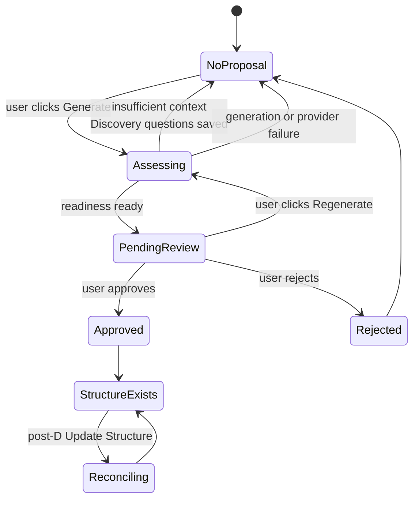

# Universe AI — Architecture

Durable technical architecture for Stage D and beyond. For product context see `docs/PROJECT.md`. For UI behavior see `docs/UI.md`. For implementation progress see `docs/CURRENT_STATE.md`.

---

## Core principle

**AI proposes; the user reviews and explicitly approves; the server applies the change atomically.**

Structural change rules:

- Every **AI-generated** structural change requires an explicitly approved proposal applied by an atomic server/database operation.
- Direct **user-initiated** structural edits do not necessarily require an AI proposal.
- **All** structural edits — whether user-initiated or AI-proposed — must use validated atomic server/database operations.
- The AI must never apply structural changes autonomously.
- No structural change may be applied from the client, from a prompt, or from an AI response without passing through a validated server-side database operation.

---

## Stage D boundary

### In scope for Stage D

- Exactly one pending structure proposal per Root Planning conversation
- Regeneration that atomically supersedes the previous pending proposal
- Proposal cards inside the chronological conversation timeline
- Code-owned, domain-neutral Root Planning system prompt
- Compact World brief supplied to Root Planning requests
- Explicit user-triggered readiness assessment
- Discovery questions when context is insufficient
- Approval and rejection
- Initial topic-node creation through an atomic RPC (one-time per World)
- Enforcement that Generate World Structure cannot create a second initial structure after topic nodes exist
- Map refresh after approval

**Optional final Stage D commit (may be deferred without blocking Stage D completion):**

- Generate with Assumptions, offered after two insufficient Discovery rounds

### Post-D (deferred)

- Updating an existing structure
- Structure Reconciliation
- KEEP / UPDATE / ADD / MOVE / ARCHIVE operations
- `nodes.archived_at`
- `worlds.structure_revision`
- Full Context Engine
- Secondary relation generation
- Cross-node impact analysis
- SPLIT / MERGE
- `conversation_events` table

---

## Product state machine

Discovery is **not** a separately persisted session state. Discovery questions are ordinary assistant messages; readiness is evaluated only on an explicit Generate click.



**Derived persisted states:**

| UI state | Database signal |
|---|---|
| No proposal | No `branch_suggestions` row with `status = 'pending'` for the conversation |
| Pending review | Exactly one row with `status = 'pending'` |
| Assessing | An `ai_run` with `status = 'running'` and branch-suggestion metadata for the conversation |

**User-facing actions:**

| Action | When available |
|---|---|
| Generate World Structure | World has no approved topic-node structure yet; no active assessing run; explicit click only |
| Discovery | Returned when readiness is insufficient; questions appear as an assistant message |
| Regenerate | A pending proposal exists; supersedes on success |
| Approve | Exactly one pending proposal |
| Reject | Exactly one pending proposal |

**Update Existing Structure** is a separate post-D flow for Worlds that already have an approved structure.

---

## Proposal lifecycle

### Persisted statuses

- `pending` — awaiting user review
- `approved` — user approved; nodes created
- `rejected` — user rejected
- `superseded` — replaced by a newer proposal during regeneration

### Invariant

At most one `pending` proposal per `conversation_id`, enforced by a PostgreSQL partial unique index:

```sql
create unique index branch_suggestions_one_pending_per_conversation_idx
  on public.branch_suggestions (conversation_id)
  where status = 'pending';
```

UI logic alone cannot enforce this. The index survives concurrent requests and direct database access.

### Regeneration

1. Generate and validate the replacement proposal first.
2. If generation fails, the existing pending proposal is preserved unchanged.
3. On success, atomically mark the old proposal `superseded` and insert the new `pending` proposal.
4. Historical proposals (`approved`, `rejected`, `superseded`) are retained for audit.

### Approval and rejection

- Only `pending` proposals may transition.
- Approval and rejection must each be atomic database operations.
- `superseded` proposals must never be approvable.

The existing `approve_branch_suggestion` RPC creates initial topic nodes under Root. It is suitable for initial structure creation only. Structure Reconciliation requires a separate future RPC.

---

## Initial structure creation (one-time per World)

**Generate World Structure** is the initial-structure flow. It is available only while the World does not yet have an approved or created topic-node structure.

After initial topic nodes exist:

- Generate World Structure must not create or approve another initial structure.
- The future action for a structured World is **Update Existing Structure** (post-D).
- Server, database, and RPC validation must enforce this — not only the UI.
- The API should eventually return a stable conflict such as `structure_already_exists`.

Implementation must derive structure existence from authoritative database state (for example, whether topic nodes already exist under Root for the World) and **recheck atomically during approval**. The exact detection mechanism is not finalized here; it must be verified against the current schema during implementation.

`approve_branch_suggestion` must reject approval when an initial structure already exists for the World.

---

## Active generation and stale runs

A running branch-suggestion `ai_run` must not block generation forever after a server crash or abandoned request.

Requirements:

- Active-generation detection requires a **bounded stale-run policy**. Stale `running` branch-suggestion runs should be safely failed or ignored according to the final implementation.
- Prefer a **database-enforced invariant** that prevents more than one active Branch Suggestion generation per conversation.
- The guard should occur **before calling OpenAI** whenever possible.
- The exact index and/or RPC approach must be verified against PostgreSQL and the existing `ai_runs` schema during implementation.

---

## Database changes (approved target)

### Migration sequencing

**Migration 1 — enum only (separate file):**

```sql
alter type public.branch_suggestion_status add value 'superseded';
```

PostgreSQL does not allow a newly added enum value to be used in the same transaction. The index and RPCs that reference `superseded` must be in a later migration.

**Migration 2 — invariant, RPCs, and hardening (separate file):**

1. Deterministic duplicate backfill — keep the newest pending row per conversation using `created_at desc, id desc`; mark all others `superseded` with `decided_at = now()`.
2. Create the partial unique index (see above).
3. Add `replace_pending_branch_suggestion` RPC (see below).
4. Harden `approve_branch_suggestion` — reject `superseded` (and any non-`pending`) status.
5. Add atomic `reject_branch_suggestion` RPC.

Exact commit grouping within this migration may be adjusted, but backfill must precede index creation, and approval hardening must ship in the same release sequence as the `superseded` enum value.

### `replace_pending_branch_suggestion` RPC

Approved narrow contract (exact SQL signature may be refined during implementation):

```
replace_pending_branch_suggestion(
  p_conversation_id,
  p_ai_run_id,
  p_schema_version,
  p_payload
)
```

The RPC must **derive and verify** World and parent Root node from the conversation. It must not trust separately supplied `worldId` or `nodeId` values from the client.

Required validations:

- Conversation exists
- Conversation kind is `planning`
- Conversation's node is the Root node for its World
- `ai_run` belongs to the same conversation
- `ai_run` is a Branch Suggestion run (via metadata)
- `pg_advisory_xact_lock` on the conversation id before supersede-and-insert

Returns the inserted `branch_suggestions` row.

### Deferred schema (post-D)

| Change | Purpose |
|---|---|
| `nodes.archived_at` | Archive without deletion |
| `worlds.structure_revision` | Detect stale reconciliation proposals |
| `branch_suggestions.kind` | Distinguish initial vs reconciliation payloads |
| `branch_suggestions.base_structure_revision` | Optimistic concurrency for reconciliation |
| `apply_structure_reconciliation` RPC | Atomic multi-operation apply |
| `conversation_events` | Generalized timeline for many event types |

---

## API and structured-output contracts

### Generate World Structure — POST

- Remains an explicit user action; no body required for the core flow.
- If Generate with Assumptions is implemented, accept only a strict body such as `{ mode: "auto" | "with_assumptions" }` — no prompt text.
- Forward `request.signal` for cancellation.

**Response variants (approved target):**

| Outcome | HTTP | Body |
|---|---|---|
| Ready proposal | 200 | `{ outcome: "proposal", suggestion: BranchSuggestionDto }` |
| Insufficient context | 200 | `{ outcome: "discovery", message: { id, role, content, createdAt } }` |
| Generation in progress | 409 | `{ code: "generation_in_progress" }` |
| Pending conflict (non-regenerate) | 409 | `{ code: "pending_proposal_exists" }` |
| Initial structure already exists | 409 | `{ code: "structure_already_exists" }` |
| Existing failure codes | 400/404/422/500/502/499 | Unchanged from D3 Commit 1 |

Discovery questions are persisted as one ordinary assistant message linked to `ai_run_id`, with the `ai_run` completed and provider metadata stored where available.

### StructureAssessmentV1 (transient envelope)

Readiness and proposal are separate TypeScript concepts returned within **one** structured Responses API request. Only the proposal payload is persisted on the ready path.

```
StructureAssessmentV1 {
  schemaVersion: 1
  readiness: "ready" | "insufficient"
  missingInformation: string[] | null
  questions: string[] | null        // 1–3 when insufficient
  proposal: BranchSuggestionV1 | null
}
```

Server-side Zod refinement (never trust the model):

- `readiness === "ready"` → `proposal` present, `questions` absent
- `readiness === "insufficient"` → 1–3 `questions` present, `proposal` absent

Invalid envelopes map to `invalid_structured_output`.

**Persisted on ready path only:** existing `BranchSuggestionV1` (`schemaVersion`, `rationale`, `nodes`). The assessment envelope is transient.

`MAX_SUGGESTION_OUTPUT_TOKENS` should be raised to approximately 2048 before readiness and Discovery ship.

### Generate with Assumptions (optional, cuttable)

After two insufficient Discovery rounds, the product may offer this path. It should expose:

- Assumptions made
- Missing information
- Risks caused by missing context

Do not use numeric LLM confidence. A categorical readiness signal may be considered later.

### Reconciliation diff (post-D sketch)

Future `StructureReconciliationV1` will reference stable existing node ids supplied in the prompt. Server validation must reject hallucinated ids, cycles on MOVE, and stale `base_structure_revision` mismatches. SPLIT and MERGE are deferred indefinitely.

---

## Conversation timeline architecture

### Near-term (Stage D)

Derive one typed conversation timeline server-side. Do not store timeline rows separately.

```ts
type ConversationTimelineItem =
  | { kind: "message"; /* message fields */ }
  | { kind: "suggestion"; /* BranchSuggestionDto fields */ };
```

**Merge rules:**

1. Load persisted messages and the one pending proposal on the server (in `page.tsx`).
2. Order messages among themselves by `ordinal`.
3. Interleave the pending proposal by `created_at`.
4. Render the typed union in `RootPlanningChat`.
5. Remove the client mount-time GET after integration.
6. Do not serialize the full proposal into a normal chat message.
7. Proposal identity and status remain first-class database data.

**Rendering order:**

```
messages before generation → structure proposal card → later messages → composer
```

### Long-term (post-D)

A `conversation_events` table may replace multi-table derivation once execution conversations, decisions, reconciliation diffs, and tool results all need timeline placement. The typed-union merge function is the abstraction boundary; swapping the data source later is an internal change.

---

## Root Planning AI architecture

Root Planning is the strategic expert for its World — described by the product owner as the **"God of the World"**.

### Required behavior

- Understand the project's purpose and domain
- Connect new questions to World goals
- Ask how apparently unrelated information affects the project before answering as a generic assistant
- Recognize constraints, contradictions, dependencies, and risks
- Distinguish facts, assumptions, decisions, and recommendations
- Recommend professional and efficient planning for the current domain
- Remain open to topics that may be relevant after clarification
- Never assume a software project; remain domain-neutral

### Prompt ownership (approved target)

Move the system prompt from the database into code. The persisted system-message row inserted by `create_world_with_root` is **retained for backward compatibility but excluded from model input**. This applies improvements to existing Worlds without a data backfill.

Stage C streaming (`root-planning-chat.ts`), persistence, abort handling, and the NDJSON protocol are unchanged apart from which input builder is called.

### Compact World brief (approved target)

Inject a short, code-computed block on every Root Planning request, built from existing data:

- World name and description
- Root node title and goal
- Current node titles, capped at approximately 20 entries

Cost is approximately 100–300 tokens. Deterministic, pure, and unit-testable. No new tables.

### Context Engine (post-D)

A prompt-only solution is not sufficient long-term. A future Context Engine will maintain world summary, goals, success criteria, constraints, decisions, assumptions, open questions, node structure, execution state, research, and recent changes. This requires its own extraction pipeline and storage design.

### Known limitation

`MAX_NON_SYSTEM_MESSAGES = 40` silently drops older turns. Binding decisions made early in a long session will eventually be lost from the model context. Not a Stage D blocker; address with summarization in a future stage.

---

## Cross-domain neutrality

Universe AI must work professionally for software projects, books, physical products, events, businesses, operational programs, and other long-running structured goals.

**Domain-neutral concepts to prefer:**

| Concept | Use for |
|---|---|
| workstream | A major area of effort |
| stage | A phase within a workstream |
| responsibility | Who or what owns an outcome |
| outcome | What success looks like for an area |
| dependency | What must happen before something else |
| deliverable | A concrete output |

**Do not assume:** frontend, backend, database, API, or software architecture unless the conversation establishes a software project.

The core schema (`World`, `Node` with title/description/goal, planning/execution conversations) is already domain-neutral. Software-specific leakage exists in generation instructions and the persisted system prompt; both are addressed by the prompt-ownership and domain-neutrality work in Phase D6.

---

## Uncommitted D3 UI — approved disposition

The local D3 Commit 2 UI is **not accepted as-is** but should be **partially reused**.

**Preserve:**

- Explicit Generate action
- Client-safe API parsing (`branch-suggestion-api.ts`)
- `AbortController` behavior and abort on unmount
- Duplicate-click prevention
- Safe error handling (no raw provider/database details)
- Proposal-card markup
- Most existing CSS (rename `.branch-suggestions-panel__*` → `.branch-suggestion-card__*`)

**Refactor:**

- `BranchSuggestionsPanel` → `BranchSuggestionCard` (card only) plus chat-level Generate action
- Remove panel placement between messages and composer
- Remove mount-time GET
- Remove multiple-pending list semantics and `prependSuggestionDeduped`
- Load pending proposal server-side
- Render as a chronological timeline item

---

## React UI testing (unresolved)

React Testing Library and a DOM test environment (e.g. jsdom) are **recommended** for the upcoming timeline, Discovery, and approval UI.

Dependencies must not be added until the product owner explicitly approves them (`AGENTS.md`).

Until then:

- Pure helpers (timeline merge, state updates, API parsers) are unit-tested with Vitest (`environment: "node"`)
- Component rendering and interaction require manual browser acceptance

---

## Architectural risks

| Risk | Mitigation |
|---|---|
| Existing duplicate `pending` rows block unique index creation | Deterministic backfill (`created_at desc, id desc`) before index |
| `superseded` enum value is permanent in PostgreSQL | Accept; do not plan to drop it |
| `approve_branch_suggestion` unsafe after `superseded` added | Harden in same release sequence as enum migration |
| Narrow concurrent Generate race may bill two AI calls | `ai_runs` pre-check + advisory lock + unique index; accept residual billing race |
| Stale `running` branch-suggestion `ai_run` blocks generation after crash | Bounded stale-run policy; fail or ignore stale runs; database-enforced single active generation per conversation |
| Second initial structure created after topic nodes exist | Derive structure existence from authoritative DB state; enforce in API and `approve_branch_suggestion`; return `structure_already_exists` |
| 40-message window drops old decisions | Document; address with summarization post-D |
| Component tests unavailable without approved deps | Manual acceptance for UI; unit test pure helpers |
| Turbopack cache failures under OneDrive project path | Use `pnpm exec next dev --webpack`; production build unaffected |

---

## Safe incremental implementation plan

Exact commit grouping may be adjusted. Migration sequencing and dependency order must be preserved.

### Phase D4 — Single pending proposal

1. **Migration:** add `superseded` enum value only (separate file).
2. **Migration:** deterministic duplicate backfill; partial unique index; `replace_pending_branch_suggestion` RPC; harden `approve_branch_suggestion` (reject non-`pending`, reject when initial structure already exists); atomic `reject_branch_suggestion` RPC; verify database-enforced single active generation per conversation.
3. Route persistence through the replacement RPC.
4. Add `generation_in_progress`, `pending_proposal_exists`, and `structure_already_exists` handling (HTTP 409).
5. Implement bounded stale-run policy for abandoned `running` branch-suggestion `ai_runs`.

*Tests:* RPC validations, `23505` mapping, running-run pre-check before OpenAI, stale-run handling, supersede preserves old proposal on generation failure, `structure_already_exists` when topic nodes already exist, approval rejected when structure already exists.
*Manual:* generate twice — second replaces first; exactly one pending row; superseded row not approvable; Generate unavailable after initial structure approved; second initial-structure attempt returns `structure_already_exists`; stale run does not block generation indefinitely.

### Phase D5 — Timeline

6. Derive server-side typed timeline (`buildConversationTimeline`).
7. Extract `BranchSuggestionCard`; refactor local UI.
8. Remove mount-time GET and multiple-list semantics.

*Tests:* pure merge ordering; suggestion after preceding messages, before later ones.
*Manual:* message sent after proposal appears below the proposal card.

### Phase D6 — Prompt architecture

9. Move Root Planning prompt ownership into code; exclude persisted system row from model input.
10. Add compact World brief.
11. Make Root Planning and Branch Suggestion instructions domain-neutral.

*Tests:* brief is deterministic and capped; system row excluded; existing Worlds benefit without backfill.
*Manual:* unrelated question triggers relevance check; non-software World produces no software-specific nodes.

### Phase D7 — Readiness and Discovery

12. Add `StructureAssessmentV1` contract with Zod refinement; raise output token limit.
13. Update generation service and API outcome variants.
14. Persist Discovery questions as assistant message linked to `ai_run`.
15. Integrate Discovery message into timeline.

*Tests:* refinement rejects inconsistent envelopes; discovery path inserts no suggestion; ready path inserts exactly one.
*Manual:* "hi"-only conversation yields questions; answering and clicking again yields proposal.

### Phase D8 — Approval

16. Approve/reject API.
17. Approve/reject UI on proposal card.
18. Refresh World Map after approval.

*Manual:* approve creates nodes; map reflects them; re-approve is idempotent; superseded not approvable.

### Optional final Stage D

19. Generate with Assumptions after two Discovery rounds (cuttable; does not block Stage D completion).

---

## Documentation map

| File | Contains |
|---|---|
| `AGENTS.md` | Agent workflow rules; pointer here; structural-change hard rule |
| `docs/PROJECT.md` | Product truth, glossary, cross-domain requirement |
| `docs/UI.md` | Visual identity, timeline placement, proposal card states |
| `docs/ARCHITECTURE.md` | This file — durable technical architecture |
| `docs/CURRENT_STATE.md` | Progress log only |
